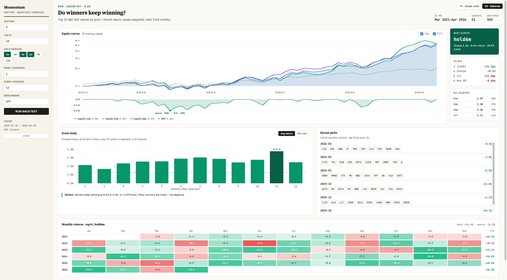

# S&P 500 Momentum Backtest

Tests the thesis: do top monthly performers in the S&P 500 keep outperforming?
Two analyses — an event study (avg forward returns of top-N cohorts) and a
Jegadeesh-Titman overlapping-sleeves backtest — exposed via a CLI and a
local React dashboard backed by FastAPI.



## Install

**macOS / Linux:**

```bash
python3 -m venv .venv
.venv/bin/pip install -r requirements.txt
```

**Windows (PowerShell or cmd):**

```powershell
python -m venv .venv
.venv\Scripts\pip install -r requirements.txt
```

## Run

**Web dashboard** — two variations, switchable from a top-right toggle (also
addressable via `#v1` / `#v2` URL hash):

- **V1 · Stripe-calm** — cards + KPI tiles, tabbed equity / drawdown / monthly-returns chart, event study + perf table.
- **V2 · Editorial** — serif headline, equity + drawdown stacked, side rail (best sleeve / vs benchmark / all sleeves), recent-picks panel with real S&P 500 names, monthly heatmap.

Both share state and the same backend.

```bash
.venv/bin/uvicorn server:app --port 8000          # macOS / Linux
.venv\Scripts\uvicorn server:app --port 8000      # Windows
```

Open `http://localhost:8000`. Set parameters in the sidebar, click
**Run backtest**.

**CLI** (writes PNG + CSV to `./momentum_output/`):

```bash
.venv/bin/python momentum_backtest.py             # macOS / Linux
.venv\Scripts\python momentum_backtest.py         # Windows
```

Edit the constants at the top of `momentum_backtest.py` to change parameters.

## How it's wired

```
server.py             FastAPI: /api/backtest, /api/cache, serves web/
momentum_backtest.py  CLI entry
web/
  index.html          React mount + App component + V1/V2 switcher
  v1.jsx              V1 dashboard — Stripe-calm card layout
  v2.jsx              V2 dashboard — editorial, with recent-picks panel
  charts.jsx          SVG chart primitives (equity, drawdown, event study, heatmap)
  data-loader.js      API calls + format helpers
lib/
  data.py             tickers, get_prices (cache-aware), monthly returns
  analysis.py         event_study, momentum_backtest, perf_stats
  plotting.py         matplotlib Figure builders (CLI only)
  cache.py            parquet cache with delta fetches
cache/                prices.parquet + meta (gitignored)
```

See `PLAN.md` for the original design rationale.

## Notes

- **First run downloads ~500 tickers** from Yahoo (~60–120 s). Subsequent
  runs hit the parquet cache (sub-second). The cache is in `cache/`.
- **Cache freshness:** within 6 h of a fetch, the cache is taken as-is.
  After 6 h, the trailing 2 days are re-pulled to catch late-posted bars.
  Use the **Clear cache** button in the sidebar to force a cold refresh.
- **Frontend is React from CDN** (no build step). All JSX is transpiled in
  the browser by Babel-standalone — fine for a single-user local tool.
- **macOS / corporate networks:** if your machine sits behind a TLS-inspection
  proxy, the data layer auto-exports your macOS keychain CAs to
  `cache/macos_ca_bundle.pem` on first run so Wikipedia and Yahoo requests
  succeed. No manual setup required.
- **Windows behind a corporate proxy:** the keychain auto-export is
  macOS-only. If downloads fail with SSL errors, point
  `REQUESTS_CA_BUNDLE` at your corporate CA bundle before running
  (`set REQUESTS_CA_BUNDLE=C:\path\to\ca-bundle.pem`). On a home network
  nothing is needed.

## Caveats (carried from the original script)

- Survivorship bias — uses the *current* S&P 500 list; effect grows with
  longer lookbacks.
- Look-ahead-clean — ranking uses month-end data only, forward returns
  start the next month.
- Ignores transaction costs, taxes, slippage. Equal weight, no risk
  constraints.
